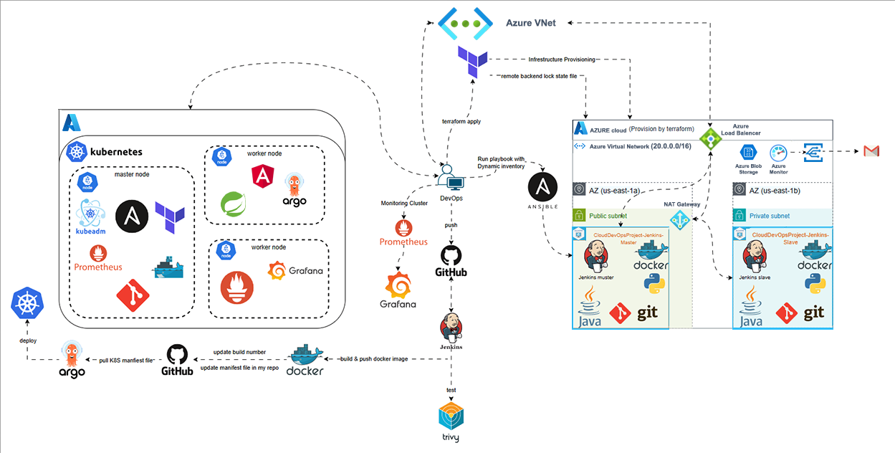

# DevOps CI/CD Azure Project

Welcome to the **DevOps CI/CD Azure Project**, a practical implementation of a Continuous Integration and Continuous Deployment (CI/CD) pipeline for an Angular application using Azure infrastructure, Jenkins, K3s, and ArgoCD. This project demonstrates a secure, scalable, and monitored deployment workflow.

## Project Overview

This repository contains the code and configuration to automate the build, test, and deployment of an Angular application on a lightweight Kubernetes cluster (K3s) hosted on Azure VMs. The pipeline is orchestrated by Jenkins and managed with GitOps principles using ArgoCD.

## Architecture

The architecture includes:
- **GitHub**: Source code repository.
- **Jenkins**: CI/CD server running on `jenkins-vm` for building and pushing Docker images.
- **ArgoCD**: GitOps tool deployed on `k3s-vm` for continuous deployment.
- **K3s**: Lightweight Kubernetes cluster.
- **Azure VMs**: `jenkins-vm` and `k3s-vm` connected via a Virtual Network (VNet) with a Network Security Group (NSG).
- **Docker Hub**: Registry for Docker images.

## Setup Instructions

1. **Prerequisites**:
   - Azure account (e.g., Azure for Students with 100$ credit).
   - Git, Terraform, Azure CLI, and Docker installed on your machine.
   - SSH key pair for VM access.

2. **Deployment**:
   - Clone this repository: `git clone https://github.com/mohamedazizGmaty/DevOps-CI-CD-azure-project.git`.
   - Navigate to the `Terraform` directory: `cd Terraform`.
   - Initialize and apply Terraform: `terraform init && terraform apply`.
   - Start VMs: `az vm start -g mydevops-rg -n jenkins-vm` and `az vm start -g mydevops-rg -n k3s-vm`.

3. **Access**:
   - SSH into `jenkins-vm`: `ssh -i ~/.ssh/id_rsa azureuser@<jenkins_ip>`.
   - Access Jenkins UI at `http://<jenkins_ip>:8080`.

## Pipeline Overview

The CI/CD pipeline includes stages:
- **Checkout**: Pull code from GitHub.
- **Build**: Compile the Angular app.
- **Test**: Run unit tests.
- **Build & Push**: Create and push Docker image to Docker Hub.
- **Deploy**: Sync with ArgoCD for Kubernetes deployment.

## Technologies Used
- **Azure**: VMs, VNet, NSG.
- **Jenkins**: CI/CD automation.
- **K3s**: Lightweight Kubernetes.
- **ArgoCD**: GitOps deployment.
- **Docker**: Containerization.
- **Angular**: Frontend application.

## Next Steps
- Configure the Jenkins pipeline for Angular deployment.
- Set up monitoring with Prometheus/Grafana.
- Implement storage with MinIO or Azure Blob.

## Contributing
Feel free to fork this repository, submit issues, or pull requests. Let's build together!

## License
MIT License - See the [LICENSE](LICENSE) file for details.
